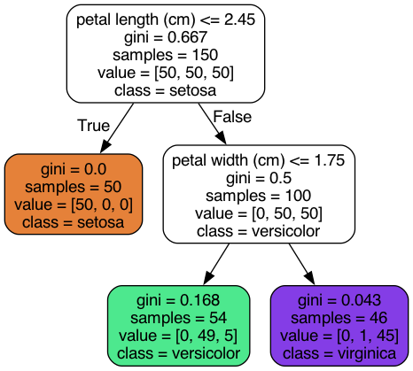

# __Decision Tree__

## __Introduction to decision Trees__

### __What is a Decision Tree?__

A decision tree is a flowchart-like structure where each internal node represents a `decision` based on a feature,
each branch represents the outcome of the `decision`, and each `leaf node` represents a class label in **classification**, 
or a value in **regression**

### __How Decision Trees Work__

Decision Trees make decisions by splitting the dataset into subsets based on the value of input features. The goal is to create
subsets that are as homogeneous as posssible with respect to the target variable.

here is an example of a Decision Tree model that is used to train the [Iris dataset](https://scikit-learn.org/stable/auto_examples/datasets/plot_iris_dataset.html):

### __Key Concepts__
1. __Nodes__   : Points where the data is split 
2. __Branches__: Possible outcomes of a decision
3. __Leaves__  : Final decision   